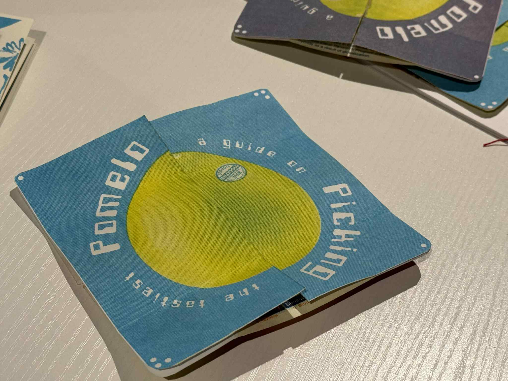

The "Pomelo Picking" zine was created using Figma, Adobe Photoshop, p5.js, and risograph printing. The design process was done on Figma and Photoshop, where the CMYK color channels were separated and prepared for printing using p5.js
Various prints were made using aqua, red, blue, green, and yellow! Using this zine, anyone should have a better time distinguishing between the various luscious pomelos during autumn/winter!

